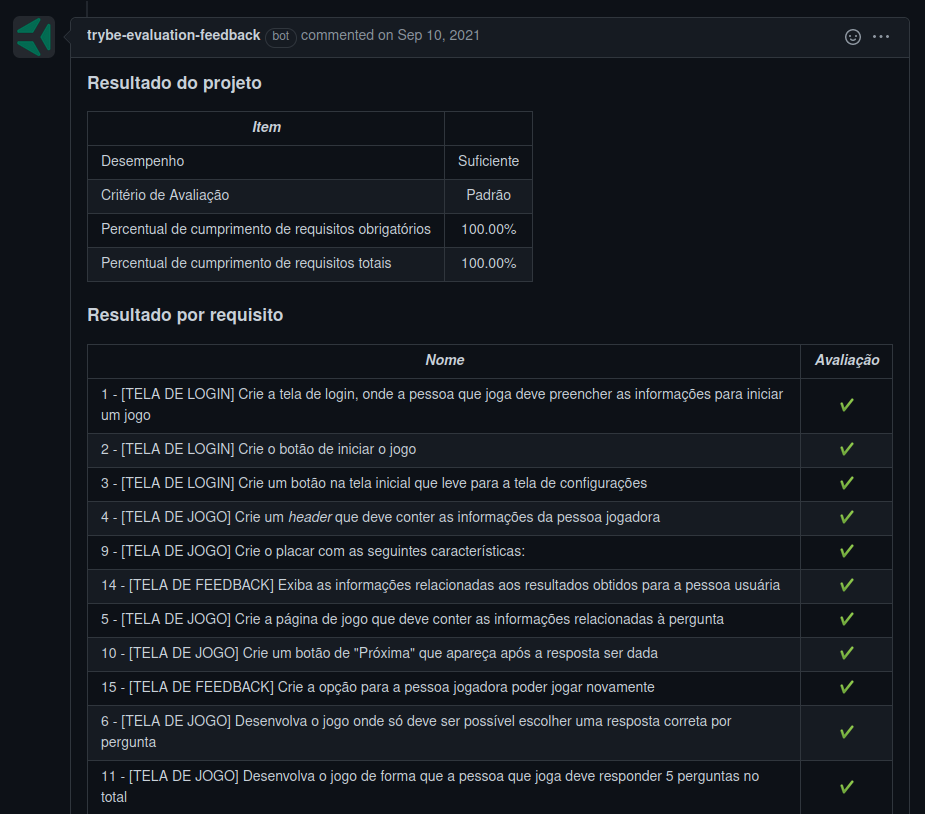
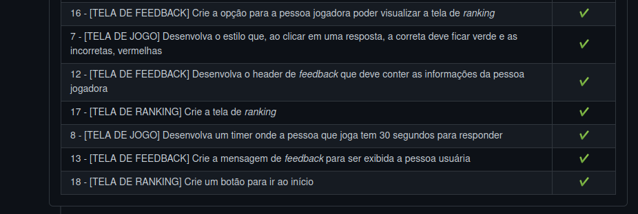

# Welcome to the Trivia APP

## Context

This project was made as a work assignment in during the Trybe web developer course.

The goal was to create a fully operational trivia game app, using a API, and utilize the learnings from the frontend module with Redux.
I was develped in a group, using the Kanban and Scrum techniques.

---

## How to install

For this project, you will need to have installed:
- NPM

Copy the ssh from the project `git@github.com:luciobj/Project-Trivia.git`

* Open a terminal int your machine and type the following commands in order:

  * `git clone git@github.com:luciobj/Project-Trivia.git`
  * `cd Project-Trivia`
  * `npm install`
  * `npm start`

  The app shoud run on the port 3000, and open a window on you default browser, fully operational.

---

## Development

This project was developed using the Kanbam and Scrum techniques, which included a well organized Trello page, daily meetings and others. We also made a complete CSS styling after the main requirements were completed.

---

### Technologies

In this project the focus was solely on frontend development, and as such the technologies used were React, React Redux for the global state manage, and a CSS styling.

---

## Evaluator Results

This is a screenshot of the last run of the Trybe evaluator, which scores the demands of the project.

